The main point of this article is to point out the amazing features in Sublime Merge, and to illustrate why you should avoid using Sourcetree. I hope my comments help to further improve both tools.

[Download Sublime Merge now!](https://www.sublimemerge.com)

Note: my experience is with the Windows versions of Sublime Merge and Sourcetree. Mileage may vary on OSX or Linux.

## What's wrong with Sourcetree?

- Slow.

- Regularly crashes and needs to be reinstalled (or requires a reboot), usually just after updating Microsoft Office.

  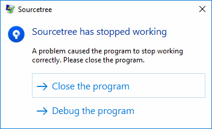

- Regularly complains about corrupt dictionaries and asks if I want to delete them.

- Regularly prompts for authentication for each repo separately (very frustrating).

- Sometimes when you click on a branch it doesn't jump to it in the graph view. Need to click on/off twice.

## What's so amazing about Sublime Merge?

I have used Sourcetree for over a year and during that time I was still learning git. After switching to Sublime Merge my knowledge of git exploded and it has been a great discovery process. Sublime Merge is a great tool and its features helped me learn git and made my workflow faster.

Below I've explained each awesome feature, followed by a comparison with SourceTree.

Please also head over to their website and read the [feature highlights](https://www.sublimemerge.com). 

- Its lightning fast.

  *(Sourcetree is a turtle in comparison)*

- The entire interface is consistent and elegant.

  *(Sourcetree is clunky)*

- It has a dark theme.

  *(Sourcetree doesn't have this feature)*

- Back/Forward navigation buttons.

  *(Sourcetree doesn't have this feature)*

- `Ctrl`+`Click` any two commits to see a diff of them.

  *(Sourcetree can do this, but its unreliable and usually doesn't give the correct result)*

- Interactive rebase commands are performed individually, and this works out to be very intuitive from a GUI. Simply select one or more commits, then use the context menu to squash, reorder, drop, amend commit message, etc.

  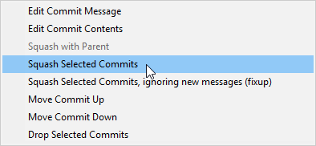

  *(The Interactive rebase interface in Sourcetree is vague and unintuitive)*

- The GUI has clear indicators to show when you are currently rebasing. You can refer to the last git command, and there are buttons to `Abort rebase` or `Continue rebase`.

	

	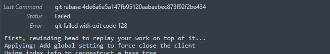

	*(Sourcetree doesn't have clear indicators that a rebase is in progress. The rebase commands to abort or continue are hidden 2 deep in a menu.)*

- Cloning a repo is wonderfully simple - you can do it in two clicks:

  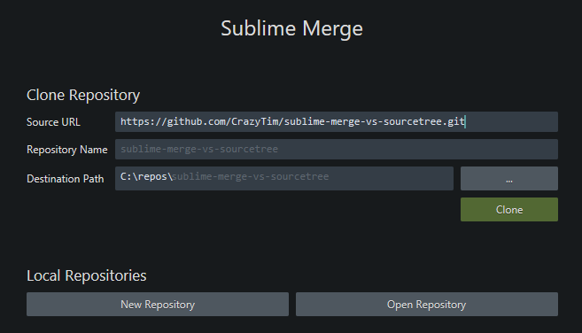

  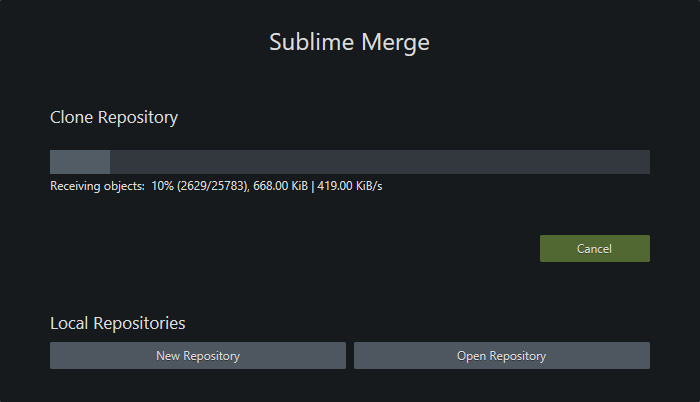

  *(In Sourcetree there are many clicks and confusing options, and its so slow performing the clone)*
  
- The work flow for resolving merge conflicts is very streamlined:

  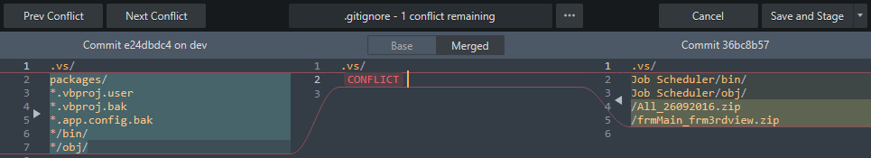

  *(The workflow in Sourcetree is vague and unintuitive)*
  
- Tool tips on some buttons show what git commands will be executed when you press them (this helps you learn git).

  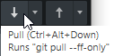

  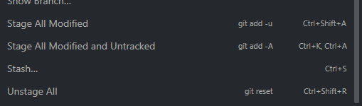

  *(Sourcetree hides most of the git internals, so you need to experiment. Labels are poorly written too, which makes it scary for learners)*

- The full path to the repo is shown in the Window title.

  *(Sourcetree doesn't have this feature)*

- Its possible to open multiple windows if that's what you need.

  *(Sourcetree opens repos as tabs inside a single window, so you can't do a side-by-side of two repos)*

- Instantly switch to another repo using `Shift`+`Ctrl`+`O`. Sublime Merge remembers the last dozen or so repos you opened.

  *(Sourcetree gets slower the more repo tabs that are open. Trying to open a repo you've opened before is painful.)*

- The checked-out branch name is prominent at the top of the window:

  

  *(Sourcetree only bolds the branch name, which is hard to see with lots of branches)*

- Easily inspect the state of any file as of a certain commit (`Right-Click` on a commit > `View Tree`). Each file is shown as a "blame" view and it is lightning fast. You can see the relative age of each line, and hover over the line to get more info about the commit.

  *(Sourcetree blame isn't as flexible. You need to blame files individually using `right-click` menus. Sourcetree calls blame "Annotate" (deprecated term), and it opens in a new window (which could be handy)).*

- Diff shows you the individual characters that have changed.

  *(Sourcetree doesn't have this feature)*

- Easy to copy text from the diff view (SourceTree only allows you to copy line-by-line).

  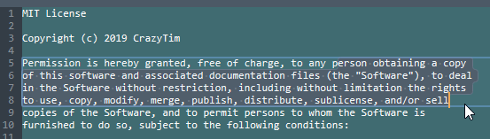

- Hide/show individual local/remote branches.

  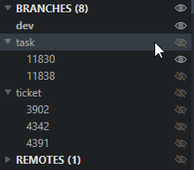

- Powerful find (`Ctrl`+`F`), and there is a query syntax:

  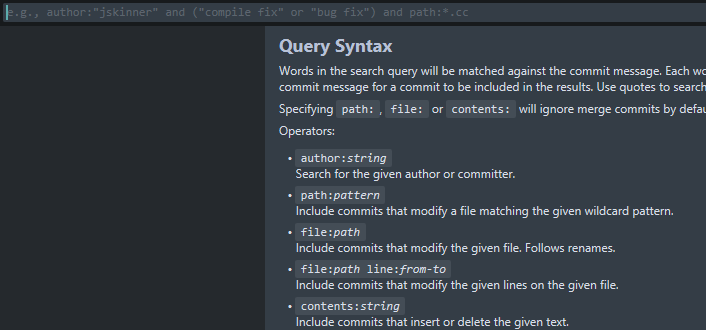

  *(Sourcetree search is slow, uninspiring, and mostly gives inaccurate results)*

- The layout adjusts well when the window is resized and everything stays in place.

  *(Occasionally the Sourcetree window can't be dragged, panels get stuck and cant be resized, and panels adjust using percentages. Also the commit message panel doesn't resize automatically like Sublime Merge.)*

- The graph design is nice and simple. You can collapse merged branches as well, which is nice.

  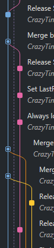
  
- Diff view changes to 2 columns when the window is large enough. I think its easier to read diffs with two columns, but it takes up more screen space so I only use it when the diff looks confusing).

  *(Sourcetree doesn't have this feature)*

- You can see stashes in the graph.

  *(Sourcetree doesn't have this feature)*

- Installation is dead simple.

  *(Source tree requires you to register with a BitBucket account, plus several other steps)*

- You can adjust the number of lines of context before/after a particular diff by `double-clicking` on the top/bottom border of the diff, or alternatively `drag` the border up/down (how cool is that!).

  *(Sourcetree only lets you choose from certain presets (1, 3, 6, etc), and this applies to every diff)*

- Automatically saves a draft of your commit message after all windows are closed you close the app.

	*(Sourcetree only saves a draft when switching tabs, and I have lost several detailed commit messages because of this)*

- You can undo/redo git actions in the `Repository` menu.

  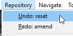

	*(Sourcetree doesn't have this feature)*

- Use `Ctrl`+`Shift`+`Z` to undo in the commit message text box.

	*(Sourcetree doesn't have this feature, need to use `Ctrl`+`Y`)*

- A progress bar is shown for predictable operations, such as merges or pushes.

  

	*(Sourcetree always shows an animated progress bar with no progress being indicated)*

- You can cancel an operation if you accidentally did it in haste (such as pushing changes) by clicking the little `x`:

  

  *(Sourcetree doesn't have this feature)*

- To navigate quickly to the current changes (staged/unstaged) view, press `Ctrl`+`1`.

	*(Sourcetree has this feature)*

## What are some features I wish Sublime Merge had?

- [coming soon!]

## License

See the [License File](./LICENSE.md).
